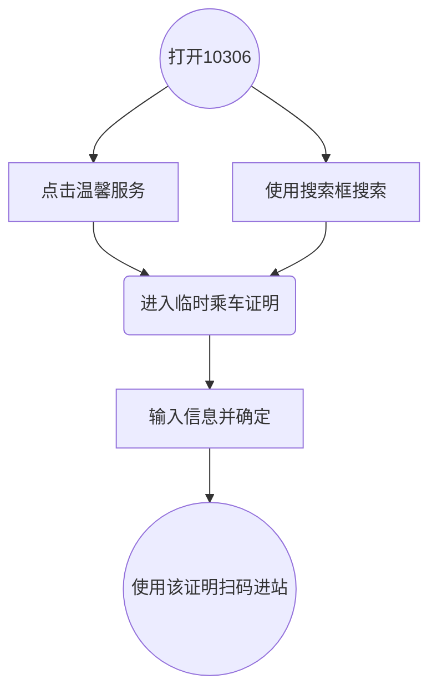

## 1. Description

> here insert  the description of this posibility

> 当需要办理临时身份证时，可以使用12306自带功能

## 2. Notice

> here insert notice things

- 该证件有效期为24小时
- 每个月最多办理3次

##3. Steps

> here insert some step or graph

### 打开手机APP `12306`

### 点击`温馨服务` 或在搜索栏搜索 `临时身份证`

### 输入信息并点击确定

### 得到临时身份证后可直接扫该证进站

## 4. Points

> here insert `posibility` or `points` on doing something